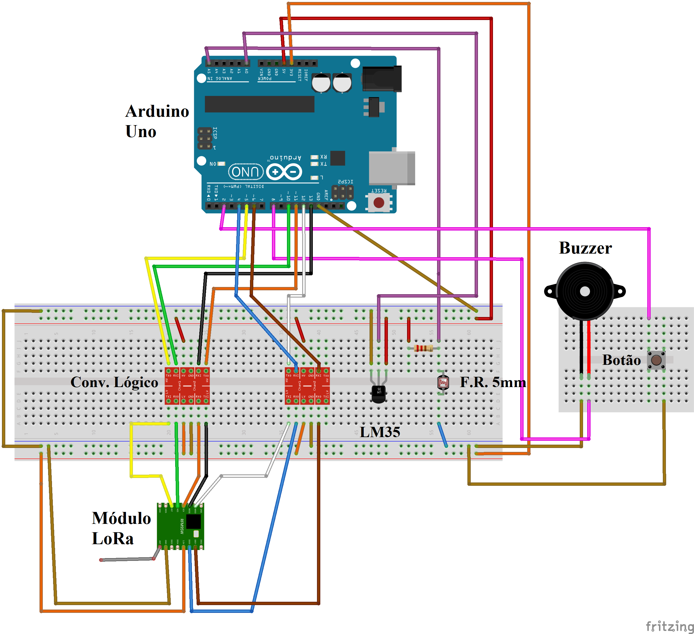
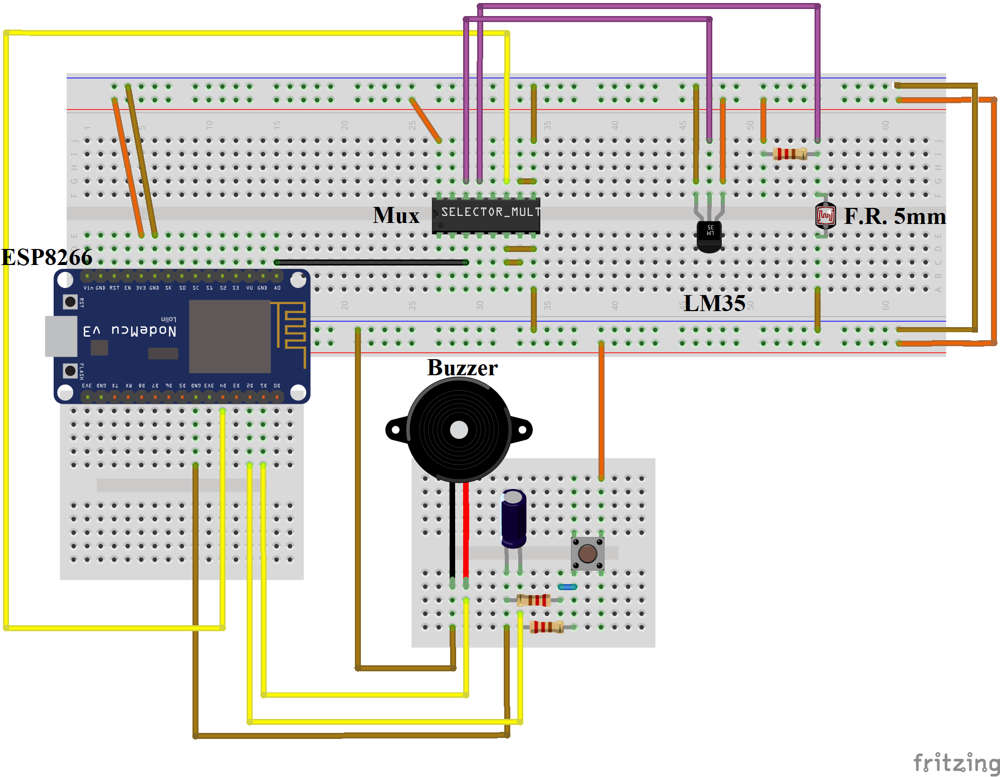

---------------------------------
### Dispositivo
---------------------------------
* MCU
  * Arduino
  * NodeMCU v3
* Módulo LoRa SX1276
* Módulo WiFi ESP8266 (embutido no NodeMCU v3)
* Sensores 
  * Temperatura
  * Luminosidade
* Atuador
  * Buzzer
* Multiplexador CD4051
* Botão para envio imediato de dado

---------------------------------
### Comunicação
---------------------------------
* 1 dispositivo para cada tecnologia e vice e versa
  * LoRa;
  * WiFi;
---------------------------------
### Circuitos
---------------------------------

  
  

---------------------------------
### Sensores
---------------------------------
* Foram testados todos os sensores LM35 disponíveis no IBTI. Nenhum sensor mostrou estar
funcionando de forma satisfatória.
* Utilizou-se o LM35 do kit a parte do Rodrigo e nele a temperatura estava mais adequada com erro de aproximadamente 1,5°C.
* O Módulo NTC 10K (Módulo vermelho OK) não estava dando valores realísticos, apenas -38°C ou acima de 200°C. Por isso, o seu uso foi descontinuado.
* O sensor de luz utilizado é um fotoresistor de 5mm. É feito um divisor de tensão com um resistor de 10KOhm para verificar a mudança indireta da resistência do fotoresistor ao analisar sua tensão.
---------------------------------
### Problemas encontrados
---------------------------------
* Usando o botão, o mesmo estava tendo alguma interferência ao utilizá-lo Normalmente Aberto. Indicando que o mesmo foi fechado, quando não havia acontecido. Como forma de resolver este problema, foi utilizado o próprio resistor de pullup do arduino em que de modo geral, inverte o funcionamento da entrada, sendo agora sensível
a níveis lógicos baixos.
* O efeito descrito acima é conhecido como bouncing. É comum em botões mecânicos. Neste projeto, utilizou-se duas soluções para este problema. Para o circuito utilizando arduino, foi utilizado o recurso de interrupção do sistema, juntamente com uma verificação da taxa de acionamentos, em que uma nova interrupção não ocorreria se o intervalo entre uma e outra fosse menor que um curto período de tempo especificado. Para o circuito utilizando o ESP8266, por não ter o recurso de interrupção,foi implementado um circuito RC para que variações bruscas da tensão do botão fossem atenuadas.
* Percebeu-se que havia apenas uma entrada analógica para os dois sensores analógicos que serão utilizados no ESP8266. Para solucionar, implementou-se um multiplexador ao circuito, o qual fará o chaveamento da leitura dos sensores, enviando para a mesma porta analógica.
* Para uma futura melhoria, pensa-se em recolher os dados pelo arduino e enviá-los pelo ESP8266. (Possível uso de SPI).
* Por algum motivo ainda desconhecido, existe uma variação de +- 3 °C na leitura do sensor de temperatura usando apenas o ESP8266. Usando o Arduino, a leitura fica mais estável, porém ainda está diferindo de 3°C do sensor de temperatura do projeto LoRa.
* Foi percebido que o arduino mapeia os valores de suas portas analógicas entre um valor de 0 e 1023. Porém, o ESP8266 mapeia o valor de sua porta analógica entre um valor de 0 a 255, ou seja, tem-se muito menos precisão com a porta analógica do ESP8266 e este é o motivo mais plausível para a problema anterior.
---------------------------------
### Arquivos
---------------------------------
* Sensor_Luz.ino e Sensor_Temp.ino 
  * Testes individuais de cada sensor
* Teste_Mux.ino 
  * Teste para o uso do multiplexador para o dispositivo com Wi-Fi  
* ttn-abp-temp-luz-INT.ino 
  * Leitura e comunicação com o dispositivo LoRa
* wifi-temp-luz_INT_GET.ino 
  * Leitura e comunicação com o dispositivo Wifi utilizando o método GET do protocolo HTTP
---------------------------------
### Links auxiliares
---------------------------------
* Biblioteca LoRa utilizada
  * https://github.com/matthijskooijman/arduino-lmic
* Biblioteca ArduinoJSON utilizada
  * https://arduinojson.org/
* Efeito Bouncing de chaves mecânicas
  * https://www.embarcados.com.br/leitura-de-chaves-debounce/#:~:text=Apesar%20do%20funcionamento%20aparentemente%20simples,figura%202%20apresenta%20esse%20efeito

